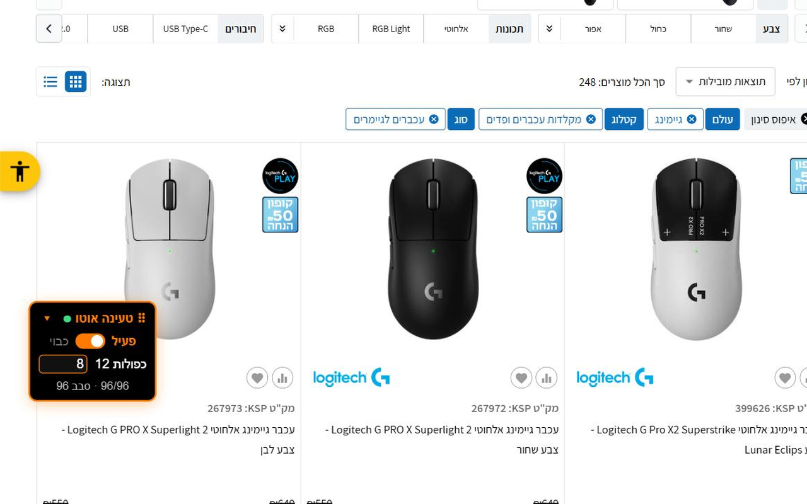

# Auto Load More for KSP

A small Chrome extension that keeps loading products on [KSP](https://ksp.co.il) category pages, so you don't have to scroll down and click **"עוד תוצאות"** (More results) over and over.

## Features

- **Automatic loading.** Open any KSP category page and products keep loading on their own.
- **You choose the batch size.** KSP loads 12 products at a time. Pick how many rounds of 12 to load, from 1 to 42 (default 8 = 96 products).
- **Stops at your target.** When the target is reached the "More results" button stays on the page. Click it yourself and the extension loads another batch of the same size.
- **On/off switch.** One toggle turns it off. The batch-size field is locked while it's off.
- **Floating panel.** A small black and orange panel shows progress. Drag it anywhere, collapse it to one line. Position and settings are remembered.
- **Plays nice with the rest of the site.** It only acts on category pages that still have products left to load, and does nothing in background tabs.

## Install

### From the Chrome Web Store
Coming soon.

### From source
1. Clone or download this repository.
2. Open `chrome://extensions` and turn on **Developer mode**.
3. Click **Load unpacked** and select the repository folder.
4. Open a KSP category page.

## How it works

The content script runs only on `ksp.co.il`. It finds the "More results" button by a class-name prefix and its text (KSP's class names are generated and change between builds), counts product cards, and clicks the button after each batch finishes loading. On the first screens, where KSP loads by infinite scroll before the button appears, it briefly jumps to the bottom of the page and back to trigger loading.

## Privacy

- Runs only on `ksp.co.il`.
- Collects no data and sends nothing anywhere.
- The only permission is `storage`, used to save your settings locally in the browser.

## Files

| Path | What |
|---|---|
| `manifest.json` | Extension manifest (MV3) |
| `content.js` | All the logic and the floating panel |
| `icons/` | Extension icons (16, 32, 48, 128) |
| `store-*`, `promo-*`, `ksp-demo*.mp4` | Chrome Web Store listing assets |

## Disclaimer

This is an independent project. It is not affiliated with, endorsed by or connected to KSP.

## License

[MIT](LICENSE)
